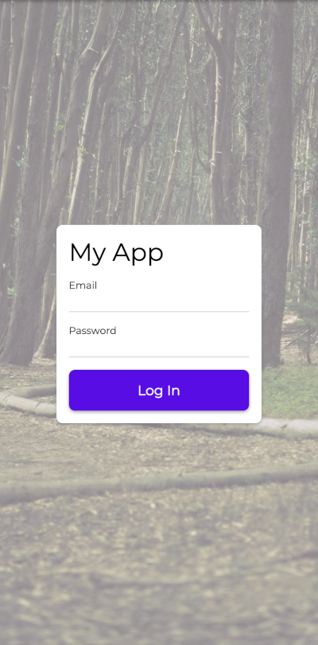
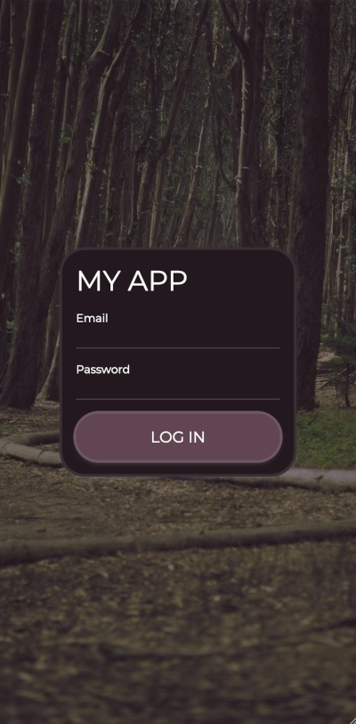

# Rock

A Kotlin Multiplatform UI Framework based on Solid.js.

## Goals

- Small JS size
- Web Client and server-side rendering, Android, iOS, eventually desktop
- Pretty by default - ugliness should take effort
- Simple Routing
- Easy to extend into native components on the platform

## Interesting design decisions

- Don't use kotlinx.coroutines, it's too big - include a custom, simpler, and more limited implementation
- Don't use a KMP network client, they're all too big - include a custom, simpler, and more limited implementation
- Base navigation around URLs to be very compatible with web
- Use themes for styling; avoid direct styling.
- Derive theme variants from existing themes.  Make theme variants semantically based.

## Project Status

Early in development.  Web is basically usable at this point, but everything is subject to change.

### TO DO:

- [X] Web Client
- [ ] Elegant handling of query parameters
- [ ] Server-side rendering
- [ ] Android
- [ ] iOS

## Sample View

[See for yourself](https://rock.cs.lightningkite.com/sample/login)

 

```kotlin
@Routable("sample/login")
object SampleLogInScreen : RockScreen {
    override fun ViewContext.render() {
        val email = Property("")
        val password = Property("")
        stack {
            image {
                source = ImageRemote("https://picsum.photos/seed/login/1080/1920")
                scaleType = ImageMode.Crop
                alpha = 0.5
            } in bordering
            col {
                space {} in weight(1f)
                col {
                    h1 { content = "My App" }
                    label {
                        content = "Email"
                        textField {
                            keyboardHints = KeyboardHints.email
                            content bind email
                        }
                    }
                    label {
                        content = "Password"
                        textField {
                            keyboardHints = KeyboardHints.password
                            content bind password
                        }
                    }
                    button {
                        h6 { content = "Log In" }
                        onClick {
                            launch {
                                fetch("fake-login/${email.once}")
                                navigator.navigate(ControlsScreen)
                            }
                        }
                    } in important
                } in card in sizedBox(SizeConstraints(maxWidth = 50.rem))
                space {} in weight(1f)
            } in scrolls() in withPadding
        } in bordering
    }
}
```